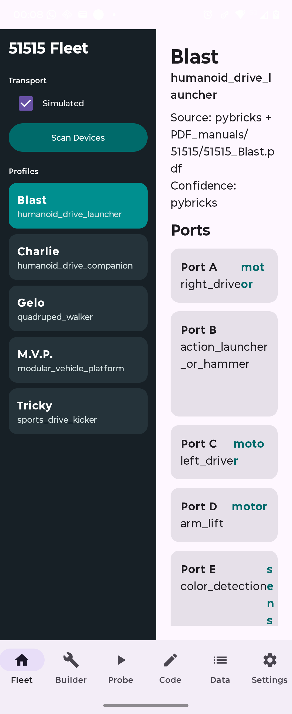
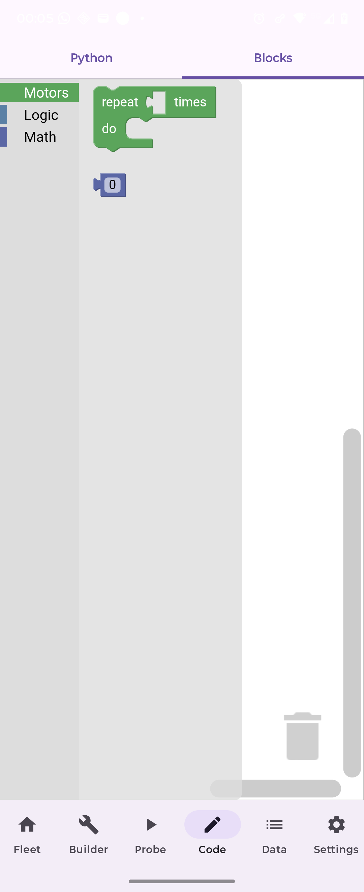

# Mindstorms Robot Creator Android

Android companion app for [Mindstorms Robot Creator](https://github.com/eoinjordan/mindstorms-robot-creator).
Build, code, and control LEGO MINDSTORMS robots from your phone.

**[Download APK](https://github.com/eoinjordan/mindstorms-robot-creator-android/releases/latest/download/app-release.apk)**

## Screenshots




## Features

- BLE and USB connection paths for MINDSTORMS hubs
- AI-assisted MicroPython code generation
- Builder session with hub status and observation log
- Session history with Room
- Safe motor probe runner
- Voice keyword spotting
- Telemetry graphs
- Simulated transport for offline testing
- Offline-first behavior; no cloud account required

## Tech Stack

- Kotlin and Jetpack Compose
- Room database for session history
- Kotlinx Serialization and Coroutines
- Material 3 adaptive layout for phone and tablet

## Build

Requires Android Studio Ladybug or later and JDK 17+.

```bash
./gradlew assembleDebug
./gradlew testDebugUnitTest
```

APKs output to `app/build/outputs/apk/`.

## Related Repos

- MCP/data/web/desktop repo: https://github.com/eoinjordan/mindstorms-robot-creator
- This Android repo publishes package `com.eoinedge.robotinventor`.

For local automation that needs the MCP repo, set:

```powershell
$env:MINDSTORMS_MCP_REPO_DIR="<mcp-repo-root>"
```

## Compatibility And License

This is an independent app. It is not an official LEGO or Pybricks product, and it does not bundle Pybricks firmware, LEGO firmware, or paid third-party coding tools.

Project code is MIT licensed. See [LICENSE](LICENSE) and [NOTICE.md](NOTICE.md).
